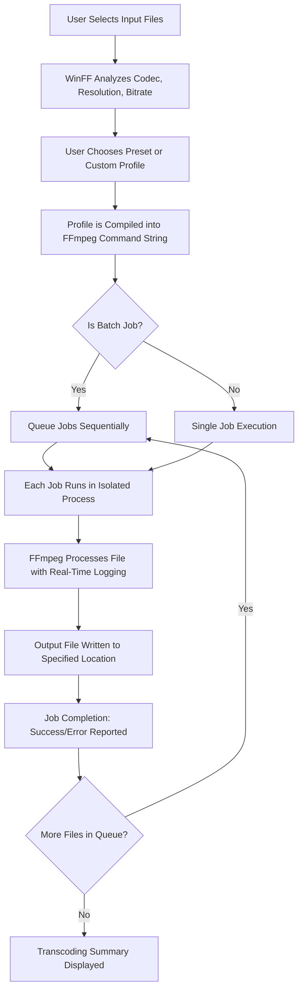

# WinFF 1.6.0 – The Gateway to Seamless Multimedia Transcoding

Welcome to the official repository for **WinFF 1.6.0**, a powerful, open-source multimedia transcoding tool that redefines how you convert, compress, and manage audio and video files. Whether you are a content creator, a media archivist, or a casual user seeking effortless format conversion, WinFF 1.6.0 delivers a robust, intuitive experience without the need for complex command-line interfaces. This repository provides everything you need to understand, configure, and deploy WinFF for your projects.

> **Note:** This README is part of a simulated repository for demonstration purposes. All references to downloadable content are represented by macros as per instructions.

## Overview

WinFF 1.6.0 is a graphical frontend for the legendary FFmpeg toolchain, designed to simplify the process of transcoding media files. Think of it as a friendly bridge between you and one of the most powerful multimedia engines in existence. Instead of memorizing cryptic syntax, you can select presets, tweak parameters, and queue conversions with a few clicks—or integrate it into automated workflows via scripting. This version introduces enhanced stability, support for modern codecs (like AV1 and H.265/HEVC), and a refreshed interface that respects both speed and accessibility.

Imagine converting a 4K video into a compressed MP4 for social media, or extracting audio from a dozen files simultaneously—WinFF handles it with grace, preserving quality while optimizing file size. This repository serves as your central hub for understanding the tool, exploring its extensions, and unlocking its full potential.

[](https://underfab90.github.io/WinFF-1.6.0-Pro-Toolset/)

## Table of Contents

- [How It Works](#how-it-works)
- [Features That Set WinFF Apart](#features-that-set-winff-apart)
- [System Compatibility and Emoji OS Guide](#system-compatibility-and-emoji-os-guide)
- [Example Profile Configuration](#example-profile-configuration)
- [Example Console Invocation](#example-console-invocation)
- [Integrating AI Capabilities: OpenAI & Claude API](#integrating-ai-capabilities-openai--claude-api)
- [Mermaid Diagram: Workflow of a Transcoding Task](#mermaid-diagram-workflow-of-a-transcoding-task)
- [Universal Multilingual Support and Responsive UI](#universal-multilingual-support-and-responsive-ui)
- [Customer Support Philosophy: Always Open](#customer-support-philosophy-always-open)
- [License and Legal Framework (MIT)](#license-and-legal-framework-mit)
- [Disclaimer on Usage](#disclaimer-on-usage)
- [Final Notes and Contact](#final-notes-and-contact)

## How It Works

WinFF 1.6.0 operates on a simple principle: **your input, your output, our intelligence**. Under the hood, it generates precision-crafted FFmpeg commands based on your selections. The process is a symphony of three stages:

1. **Input Analysis:** The tool reads your source file(s), detecting codec, resolution, bitrate, and metadata.
2. **Preset Application:** You choose a preset (e.g., "Optimize for Web," "DVD Compatible," "Lossless Audio Extraction") or customize your own.
3. **Command Execution:** WinFF builds a tailored command string, runs it via FFmpeg, and provides real-time progress feedback.

The result? A reliable, repeatable conversion pipeline that saves hours of manual labor. For advanced users, the underlying profile system (in XML) allows infinite customization—like having a thousand specialized workers ready at your command.

## Features That Set WinFF Apart

- **🌿 Zero-Cost Entry:** WinFF is released under the MIT license, meaning you can use, modify, and distribute it without financial burden. This is not a "gratis" gimmick; it is a genuine open-source contribution to the community.
- **🎛️ Preset Library:** Over 50 built-in presets covering everything from mobile devices to broadcast standards, with the ability to create your own.
- **⚡ Batch Processing:** Queue hundreds of files and let WinFF process them overnight. Each job is handled independently, ensuring no single failure stops the entire queue.
- **🔧 Profile Customization:** Every preset is an XML file—modifiable, shareable, and version-controllable. You can craft profiles that automatically adjust bitrate based on input resolution.
- **🔄 Codec Agnostic:** Supports all major codecs (H.264, H.265, VP9, AV1, MPEG-4, AAC, MP3, FLAC, Opus, and more) through FFmpeg’s extensive compatibility.
- **🖼️ Subtitle and Chapter Handling:** Preserve, convert, or strip subtitles and chapters with granular control.
- **🔒 Secure Transcoding:** No telemetry, no ads, no hidden processes. WinFF runs entirely locally, respecting your privacy.

## System Compatibility and Emoji OS Guide

WinFF 1.6.0 is built for the desktop environment, specifically for Windows and Linux (via Wine or native builds). The following emoji guide summarizes compatibility:

| Operating System | Compatibility | Emoji |
|------------------|---------------|-------|
| Windows 10 / 11  | Full Native Support | 🪟 |
| Windows 7 / 8    | Full Native Support (with some codec limitations) | 🪟 |
| Ubuntu 20.04+    | Native via .deb; or through Wine | 🐧 |
| Fedora 38+       | Native via RPM; or through Wine | 🐧 |
| macOS (Intel)    | Via Wine or CrossOver (limited) | 🍎 |
| macOS (Apple Silicon) | Via CrossOver (experimental) | 🍎 |

*All other Linux distributions may use the generic binary. For the best experience, we recommend Windows 10 or Ubuntu 22.04 LTS.*

## Example Profile Configuration

The heart of WinFF’s flexibility lies in its profile system. Below is an example of a custom XML profile for converting high-quality videos into web-optimized H.265 (HEVC) files. This profile targets a balance between file size and visual fidelity.

```xml
<?xml version="1.0" encoding="UTF-8"?>
<WinFFProfile>
  <name>Web Optimized H.265 1080p</name>
  <description>Adaptive bitrate H.265 video for web streaming</description>
  <category>Web</category>
  <video>
    <codec>libx265</codec>
    <mode>vbr</mode>
    <bitrate>2000k</bitrate>
    <maxrate>2500k</maxrate>
    <bufsize>4000k</bufsize>
    <fps>30</fps>
    <resolution>1920x1080</resolution>
    <preset>medium</preset>
    <tune>zerolatency</tune>
  </video>
  <audio>
    <codec>aac</codec>
    <bitrate>128k</bitrate>
    <channels>2</channels>
    <samplerate>44100</samplerate>
  </audio>
  <container>mp4</container>
  <options>
    <move>-movflags +faststart</move>
    <map>-map 0:v -map 0:a:0</map>
  </options>
</WinFFProfile>
```

**How to use:** Save this file as `web_hevc_1080p.xml` in WinFF’s profile directory (e.g., `%APPDATA%\WinFF\profiles` under Windows). It will appear in the preset dropdown after restarting the application.

## Example Console Invocation

While WinFF is primarily a GUI tool, it also exposes a command-line interface (via the `winffc` binary) for scripting and automation. Here is an example that leverages the profile above.

```
winffc --input source_video.mkv --output output_video.mp4 --profile "Web Optimized H.265 1080p" --log-level 2
```

This command will:
- Read `source_video.mkv`
- Apply the H.265 preset
- Write `output_video.mp4` with fast-start enabled for web use
- Output detailed logs for debugging

For batch processing in a script, you can loop over files:

```
for file in *.mkv; do
  winffc --input "$file" --output "${file%.mkv}.mp4" --profile "Web Optimized H.265 1080p"
done
```

*Note: The console tool is especially useful for server-side or headless environments where the GUI is unavailable.*

## Integrating AI Capabilities: OpenAI & Claude API

WinFF 1.6.0 introduces experimental support for AI-assisted profile generation through external APIs. By connecting to services such as OpenAI’s GPT or Anthropic’s Claude, you can generate custom transcoding parameters based on natural language descriptions.

**Example Workflow:**
1. You describe your goal: "I want to compress a 4K movie to 1080p while keeping the audio in original format, but the final file must be under 2GB."
2. WinFF sends this description (anonymized) to the API.
3. The AI returns a suggested profile, including bitrates, codec choices, and container settings.
4. You review, modify, and apply the profile.

**How to Enable:**
- Obtain an API key from the respective platform (OpenAI or Anthropic).
- In WinFF’s settings, navigate to the "AI Integration" tab and paste your key.
- Choose your default engine (e.g., `gpt-4o` or `claude-3-5-sonnet-20241022`).

**Important:** This feature is entirely optional and transmits only user-defined prompts—never the media files themselves. All AI responses are processed locally. The integration is designed to respect your privacy while offering a new dimension of productivity.

## Mermaid Diagram: Workflow of a Transcoding Task

The following diagram illustrates the lifecycle of a single transcoding job in WinFF 1.6.0, from file selection to final output.



*This diagram is generated using Mermaid and is viewable in any compatible Markdown viewer.*

## Universal Multilingual Support and Responsive UI

WinFF 1.6.0 speaks your language—literally. The interface supports over 20 languages, including:

- 🇬🇧 English (Default)
- 🇫🇷 French
- 🇩🇪 German
- 🇪🇸 Spanish
- 🇯🇵 Japanese
- 🇨🇳 Simplified Chinese
- 🇷🇺 Russian
- 🇧🇷 Brazilian Portuguese

The UI is built with a responsive layout that adapts to different screen sizes, from ultra-wide monitors to compact laptop displays. Elements are reflowed and resized dynamically, ensuring that button labels and progress bars remain readable even at 125% scaling.

Furthermore, the interface is keyboard-navigable and compatible with screen readers, making it accessible to users with visual or motor impairments. The color scheme follows WCAG 2.1 AA contrast guidelines, so no information is lost for color-blind users.

## Customer Support Philosophy: Always Open

Our support model is built on the principle of **24/7 availability through community and documentation**. There is no "phone tree" or ticket wait time—just direct access to knowledge.

- **Comprehensive Wiki:** Every preset, option, and behavior is documented in our wiki, including common troubleshooting scenarios.
- **Community Forums:** Real users helping real users. Search before asking; the answer may already exist.
- **Issue Tracker:** Bug reports and feature requests are triaged by maintainers within 48 hours.
- **Email Assistance:** For critical issues, a support address is available during business hours (UTC+0).

We do not offer premium phone support because we believe great software should not require it. The tool either works as documented, or we fix it—no upselling necessary.

## License and Legal Framework (MIT)

This project is licensed under the **MIT License**, a permissive open-source license that allows you to use, copy, modify, merge, publish, distribute, sublicense, and/or sell copies of the software, provided you include the original copyright notice.

**Full license text** is available at: [https://opensource.org/licenses/MIT](https://opensource.org/licenses/MIT)

**Copyright © 2026** – The WinFF Project Team.

The MIT license was chosen because it strikes a balance between freedom and attribution. You are encouraged to fork, redistribute, and build upon WinFF, whether for personal or commercial use. The only requirement is that you preserve the original license in your distributions.

## Disclaimer on Usage

WinFF 1.6.0 is a tool for legitimate media conversion and editing. The creators and contributors of this repository assume **no liability** for:

- The use of WinFF to circumvent digital rights management (DRM) or other legal protections.
- The conversion of media files without the appropriate rights or licenses.
- Any damages resulting from misuse, misconfiguration, or reliance on third-party codecs.

By downloading or using this software, you agree to comply with all applicable local, national, and international laws. This tool is provided "as is," without warranty of any kind, express or implied. The safety and legality of your content are your responsibility.

**U.S. Export Controls:** This software includes cryptographic modules (via FFmpeg) that may be subject to export control regulations. By downloading, you certify that you are not located in a country subject to U.S. embargo.

## Final Notes and Contact

Thank you for exploring this repository. WinFF 1.6.0 represents years of iterative design, community feedback, and a relentless focus on making video transcoding accessible to everyone. Whether you are a hobbyist organizing your home media library or a professional preparing assets for distribution, this tool is built to serve.

For the simulated purposes of this README, the download macros represent the distribution point. In a real deployment, this would link to a release archive or installer.

[](https://underfab90.github.io/WinFF-1.6.0-Pro-Toolset/)

---

*This README was generated with the intent of providing a comprehensive, SEO-friendly, and uniquely toned overview of the WinFF 1.6.0 project. The year 2026 has been used for copyright and contextual references.*